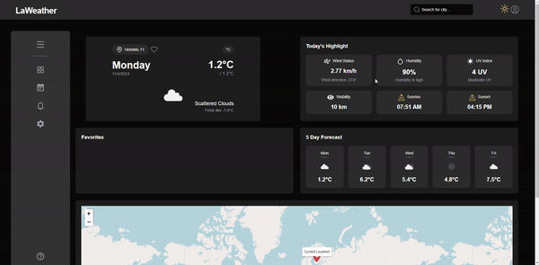
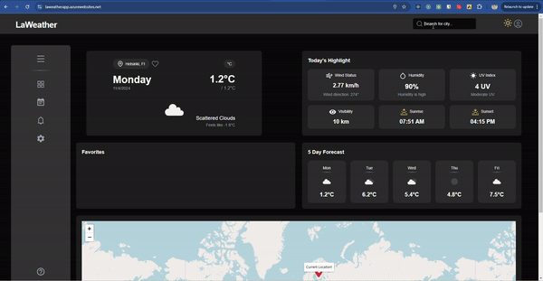
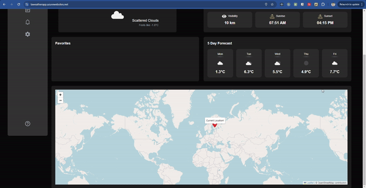
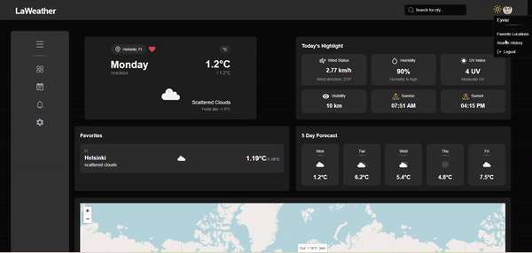

# LaWeather App



Welcome to the **LaWeather App**, a full-stack application that provides real-time weather information based on your location. Whether you're planning your day, traveling, or just curious about the weather, our app delivers accurate and timely weather data right at your fingertips.



## Table of Contents

- [Features](#features)
- [Demo](#demo)
- [Technologies Used](#technologies-used)
- [Installation](#installation)
- [Usage](#usage)
- [API Documentation](#api-documentation)
- [Contributing](#contributing)
- [License](#license)
- [Contact](#contact)

## Features

### User Authentication

- **Register, Login, and Logout functionalities.**
- **OAuth2-based authentication with Google.**
- **Secure password handling with hashing.**

### Forgot Your Password

- **Request password resets via email.**
- **Reset passwords securely using tokens.**

### Real-Time Weather Data

- **Fetches current weather information based on user location.**
- **Displays temperature, humidity, wind speed, and more.**
- **Displays detailed weather info for the user's current location by default.**

### Favorite Cities Management

- **Add and manage your favorite cities.**
- **View weather details for your favorite cities.**
- **Interactive weather map for favorite cities.**
- **Limit of two cities initially, with a “See All” button to view the rest.**

### Interactive Weather Map

- **Displays weather data visually using markers.**
- **Interactive icons indicating current weather conditions.**

### Responsive Design

- **Optimized for desktop, tablet, and mobile devices.**

### Loading Indicators

- **Visual feedback during data fetching and processing.**

### User Feedback

- **Toast notifications for success and error messages.**

### Security Enhancements

- **Rate limiting to prevent abuse.**
- **Secure token generation and handling.**

### Clean and Intuitive UI

- **Modern design with smooth animations.**
- **Tooltips for icons to indicate features available in future versions.**

## Demo

Experience the app in action with our interactive demo:

[](https://unelmacloud.com/drive/s/yuwCsqsF5Yi3kdRiESNwRXYn6lpBSF)

_Click the image above to watch the demo._

## Technologies Used

### Frontend

- **[Next.js](https://nextjs.org/)** - React framework for server-side rendering and building static websites.
- **[React](https://reactjs.org/)** - JavaScript library for building user interfaces.
- **[Redux Toolkit](https://redux-toolkit.js.org/)** - State management.
- **[TypeScript](https://www.typescriptlang.org/)** - Typed superset of JavaScript.
- **[Tailwind CSS](https://tailwindcss.com/)** - Utility-first CSS framework.
- **[Leaflet](https://leafletjs.com/)** - Interactive maps.
- **[shadcn/ui](https://github.com/shadcn/ui)** - Tooltip components.
- **[Sonner](https://github.com/brillout/sonner)** - Toast notifications.

### Backend

- **[Express.js](https://expressjs.com/)** - Web framework for Node.js.
- **[MongoDB](https://www.mongodb.com/)** - NoSQL database.
- **[Mongoose](https://mongoosejs.com/)** - ODM for MongoDB.
- **[Nodemailer](https://nodemailer.com/)** - Email sending.
- **[jsonwebtoken](https://github.com/auth0/node-jsonwebtoken)** - JSON Web Tokens for authentication.
- **[bcryptjs](https://github.com/dcodeIO/bcrypt.js)** - Password hashing.
- **[express-rate-limit](https://github.com/nfriedly/express-rate-limit)** - Rate limiting middleware.

## Installation

Follow these steps to set up the Weather App locally on your machine.

### Prerequisites

- **Node.js** (v14 or later)
- **npm** or **Yarn**
- **MongoDB** instance (local or hosted)
- **Email Service Credentials** (e.g., Gmail, SendGrid)

### Backend Setup

1. **Clone the Repository**

   ```bash
   git clone https://github.com/CodeLaMat/La_Weather.git
   ```

2. **Navigate to the Backend Directory**

   ```bash
   cd weather-app/weather-app-backend
   ```

3. **Install Dependencies**

   Using npm:

   ```bash
   npm install
   ```

   Or using Yarn:

   ```bash
   yarn install
   ```

4. **Configure Environment Variables**

   Create a `.env` file in the `weather-app-backend` directory and add the following:

   ```env
   GOOGLE_CLIENT_ID=your_google_client_id
   GOOGLE_CLIENT_SECRET=your_google_client_secret
   PORT=5000
   MONGO_URI=your_mongodb_connection_string
   JWT_SECRET=your_jwt_secret_key
   EMAIL_SERVICE_HOST = "gmail"
   EMAIL_FROM=your_email@example.com
   EMAIL_PASSWORD=your_email_password
   EMAIL_SERVICE_USER = your_email@example.com
   CLIENT_URL=http://localhost:3000

   ```

````

**Notes:**

- Replace `your_mongodb_connection_string` with your MongoDB URI.
- Replace `your_jwt_secret_key` with a secure key for JWT.
- Replace email credentials with your actual details. Consider using app-specific passwords for Gmail.

5. **Start the Backend Server**

Using npm:

```bash
npm run dev
````

Or using Yarn:

```bash
yarn dev
```

The server should be running at `http://localhost:5000`.

### Frontend Setup

1. **Navigate to the Frontend Directory**

   Open a new terminal window and navigate to:

   ```bash
   cd weather-app/weather-app-frontend
   ```

2. **Install Dependencies**

   Using npm:

   ```bash
   npm install
   ```

   Or using Yarn:

   ```bash
   yarn install
   ```

3. **Configure Environment Variables**

   Create a `.env` file in the `weather-app-frontend` directory and add the following:

   `````env
   GOOGLE_CLIENT_ID=your-client-id
   GOOGLE_CLIENT_SECRET=your_google_client_secret
   NEXTAUTH_SECRET=your_next_auth_secret
   NODE_ENV=development
   NEXTAUTH_URL=http://localhost:3000
   NEXT_PUBLIC_BACKEND_IP_ADDRESS=localhost
   NEXT_PUBLIC_BACKEND_PORT=5000   ```

   Create a `.env.local` file in the `weather-app-frontend` directory and add the following:

   ````env.local --
   NEXT_PUBLIC_OPENWEATHER_LINK=https://api.openweathermap.org/data/2.5/forecast?
   NEXT_PUBLIC_OPENWEATHER_API_KEY=your-api-for-openweathermap

   **Notes:**

   - Ensure the backend URL matches where your backend server is running.

   `````

4. **Start the Frontend Server**

   Using npm:

   ```bash
   npm run dev
   ```

   Or using Yarn:

   ```bash
   yarn dev
   ```

   The app should be running at `http://localhost:3000`.

## Usage

1. **Register an Account**

   - Navigate to `http://localhost:3000/register`.
   - Enter your email and a secure password to create an account.

2. **Login**

   - Navigate to `http://localhost:3000/login`.
   - Enter your credentials to access the app.

3. **View Weather Data**

   - Once logged in, the app will display real-time weather information based on your location.

4. **Reset Password**

   - If you forget your password, navigate to `http://localhost:3000/reset-password`.
   - Enter your registered email to receive a password reset link.
   - Click the link in your email to set a new password.

5. **Logout**

   - Click the **Logout** button to securely end your session. This action clears your weather data from the app.

   

## API Documentation

### Authentication Routes

#### Register

- **Endpoint:** `POST /api/auth/register`
- **Description:** Registers a new user.
- **Request Body:**
  ```json
  {
    "email": "user@example.com",
    "password": "securepassword"
  }
  ```
- **Response:**
  - **Success:** `201 Created`
  - **Error:** `400 Bad Request` or `500 Internal Server Error`

#### Login

- **Endpoint:** `POST /api/auth/login`
- **Description:** Authenticates a user and returns a JWT.
- **Request Body:**
  ```json
  {
    "email": "user@example.com",
    "password": "securepassword"
  }
  ```
- **Response:**
  - **Success:** `200 OK` with JWT and user details.
  - **Error:** `400 Bad Request` or `500 Internal Server Error`

#### Logout

- **Endpoint:** `POST /api/auth/logout`
- **Description:** Logs out the user by invalidating the JWT.
- **Response:**
  - **Success:** `200 OK`
  - **Error:** `400 Bad Request` or `500 Internal Server Error`

#### Request Password Reset

- **Endpoint:** `POST /api/auth/request-password-reset`
- **Description:** Sends a password reset email to the user.
- **Request Body:**
  ```json
  {
    "email": "user@example.com"
  }
  ```
- **Response:**
  - **Success:** `200 OK` with a generic success message.
  - **Error:** `429 Too Many Requests` or `500 Internal Server Error`

#### Reset Password

- **Endpoint:** `POST /api/auth/reset-password`
- **Description:** Resets the user's password using a valid token.
- **Request Body:**
  ```json
  {
    "token": "reset_token_here",
    "password": "newsecurepassword"
  }
  ```
- **Response:**
  - **Success:** `200 OK` with a success message.
  - **Error:** `400 Bad Request` or `500 Internal Server Error`

### Weather Routes

_(Assuming there are specific API routes for fetching weather data)_

#### Get Current Weather

- **Endpoint:** `GET /api/weather/current`
- **Description:** Retrieves current weather data based on location.
- **Headers:**
  - `Authorization: Bearer <JWT>`
- **Query Parameters:**
  - `lat`: Latitude
  - `lon`: Longitude
- **Response:**
  - **Success:** `200 OK` with weather data.
  - **Error:** `401 Unauthorized`, `400 Bad Request`, or `500 Internal Server Error`

## Contributing

Contributions are what make the open-source community such an amazing place to learn, inspire, and create. Any contributions you make are **greatly appreciated**.

### Steps to Contribute

1. **Fork the Project**

   Click the **Fork** button at the top right of the repository to create your own forked version.

2. **Clone Your Fork**

   ```bash
   git clone https://github.com/CodeLaMat/La_Weather.git
   ```

3. **Navigate to the Project Directory**

   ```bash
   cd weather-app
   ```

4. **Create a New Branch**

   ```bash
   git checkout -b feature/YourFeatureName
   ```

5. **Make Your Changes**

   Implement your feature or bug fix.

6. **Commit Your Changes**

   ```bash
   git commit -m "Add Your Feature Description"
   ```

7. **Push to the Branch**

   ```bash
   git push origin feature/YourFeatureName
   ```

8. **Open a Pull Request**

   Navigate to your fork on GitHub and click the **New Pull Request** button.

### Guidelines

- **Code Quality:** Ensure your code follows the project's coding standards and best practices.
- **Testing:** Write tests for your features or bug fixes.
- **Documentation:** Update the README or other documentation as needed.
- **Respect the Maintainers:** Be patient and respectful in all interactions.

## License

This project is licensed under the MIT License - see the [LICENSE](LICENSE) file for details.

## Contact

- **Project Link:** [https://github.com/CodeLaMat/La_Weather](https://github.com/CodeLaMat/La_Weather)
- **Email:** eyvaz.alishov@gmail.com

---

Thank you for using the Weather App! If you encounter any issues or have suggestions for improvements, feel free to open an issue or submit a pull request.
